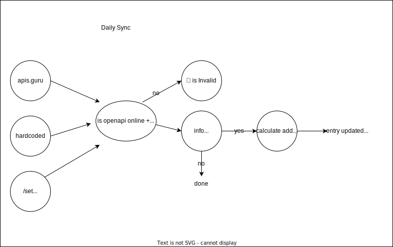

OpenAPI-Search combines multiple OpenAPIs in a fast, organized, and searchable interface.

OpenAPIs are effectively closed if there isn't an accessible way to find and use them. Big commercial API directories such as https://rapidapi.com are currently dominating the search results and the # of APIs indexed, leading many developers to a non-open API gateway. Open Source is far behind.

The best OpenAPI directory as of yet is https://apis.guru but this doesn't even reach 10% of the amount of listed APIs and there is many room for improvement.

The vision of https://openapisearch.com is to make OpenAPIs truly open by making it accessible (easy to find what you're looking for) and improving listing quality.

# Goals

Targeted improvements compared to https://apis.guru:

- Semantic search
- Related APIs
- Programmatic Registry
- Improved Website

Wishlist:

- E2E Testing of OpenAPIs
- AI Crawler for API Discovery
- AI Crawler to augment OpenAPI Metadata
  - Adds authentication + scope info
  - Adds useful links
  - Adds reviews
  - Adds pricing info, ratelimit info, etc

## Non-goals

- Create a docs reference website like [readme.com](https://readme.com) (there are many) - for this we're using stoplight now.
- Add weird custom logic that is non-standard to the OpenAPI. Instead, I aim to create a layer on top of openapis to improve the implementation of the standard. I'll use [actionschema](https://actionschema.com) for this.

# Sync process

This is the intended daily synchronisation process which ensures search results are up-to-date and of high quality. Besides filtering out invalid OpenAPIs, OpenAPISearch also generates useful metadata so enhance listing quality.

# TODO

# Stabilize + Cache chat.actionschema.com

- Fix problem with weird anthropic generations
- Cach inputs if no tools are left or if allowed to cache

# Calculated data

- Bring back openapiSummary without dependency
- Create info.x-generated-description for all items based on summary and other metadata.
- Create categories using LLM too (using x-generated-description and hardcoded categories)
- 10 related providers out of 50 using search + LLM
- Reindex all with generated description in data

# MAKING ACTIONSCHEMA STABLE:

1. At semantic-operation-search, sync with metadata
2. ActionSchema Lucky search should work and be fast

For more ideas and wishes, see [backlog](BACKLOG.md)
